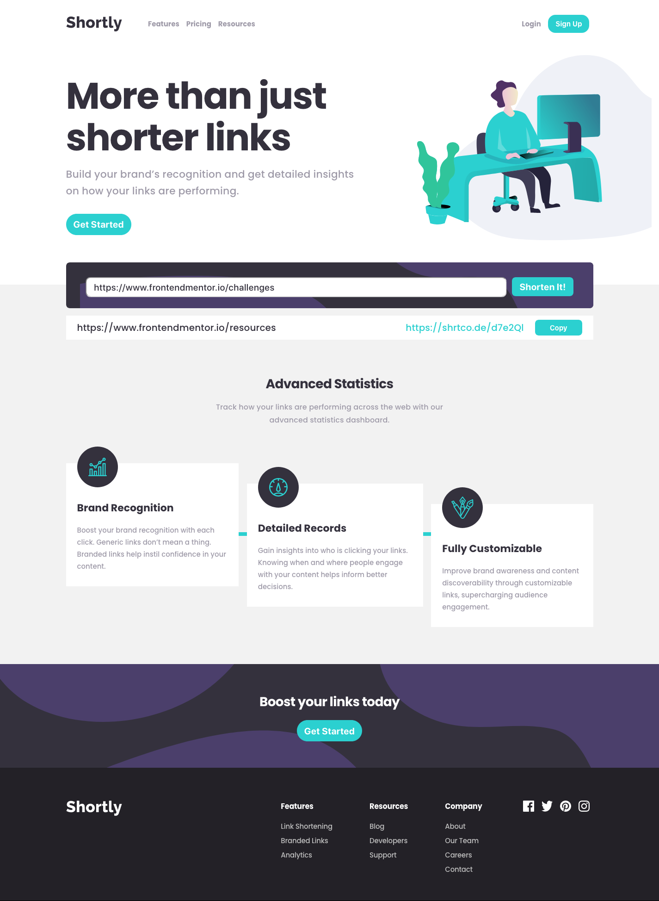

# Frontend Mentor - Shortly URL shortening API Challenge solution

This is a solution to the [Shortly URL shortening API Challenge challenge on Frontend Mentor](https://www.frontendmentor.io/challenges/url-shortening-api-landing-page-2ce3ob-G).

## Table of contents

- [Overview](#overview)
  - [The challenge](#the-challenge)
  - [Screenshot](#screenshot)
  - [Links](#links)
- [My process](#my-process)
  - [Built with](#built-with)
  - [Continued development](#continued-development)
  - [Useful resources](#useful-resources)
- [Author](#author)

## Overview

### The challenge

Users should be able to:

- View the optimal layout for the site depending on their device's screen size
- Shorten any valid URL
- See a list of their shortened links, even after refreshing the browser
- Copy the shortened link to their clipboard in a single click
- Receive an error message when the `form` is submitted if:
  - The `input` field is empty

### Screenshot

#### Desktop View

#### Mobile View

### Links

- Solution URL: [Github Repository](https://github.com/MiguelSteph/shorten-link-challenge)
- Live Site URL: [Add live site URL here](https://your-live-site-url.com)

## My process

### Built with

- Semantic HTML5 markup
- CSS custom properties
- Flexbox
- CSS Grid
- Mobile-first workflow
- [React](https://reactjs.org/) - JS library

### Continued development

In future, I will focus on the following areas and features:

- Refactoring of the code to make the components more reausable
- Add Login and Sign Up with Google, Facebook, LinkedIn and Github

### Useful resources

- [Code With Mosh Mastering React Course](https://codewithmosh.com/p/mastering-react) - This is an amazing course that helped me to learn REACT. I recommend that to anybody who is new to REACT.

## Author

- Linkedin - [Miguel KAKANAKOU](https://www.linkedin.com/in/kakanakou-miguel/)
